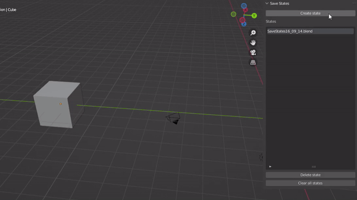

# :floppy_disk: Save States
Are you a serial saver like me who clutters their project folder with multiple .blend files? Then this add-on is for you! SaveStates allows you to create "quicksaves" of your Blender project and organizes them in a folder for you.

## Getting Started

### Prerequisites

A folder 'PROJECTNAME_SaveStates' is created in your project folder when you create a state for the first time. You can create a save state once every second, as states are organized based on the time they're created (saving too fast will create duplicates). 

**WARNING:** It is highly advisable to move a save state to its own folder outside of the _SaveStates folder, or merge it with the original file when you want to continue the project with it. Using the add-on on a state will create a new save state folder inside the save state folder (ugh, recursive problems).

This add-on is only compatible with these Blender versions:
> Blender 2.80+

### Installing

Download SaveStates.py then [read here for instructions on installing](https://docs.blender.org/manual/en/latest/editors/preferences/addons.html)

## Built With
- Python 3

## Acknowledgements
- [Darkfall](https://www.youtube.com/@DarkfallBlender) on Youtube for his Blender add-on tutorials
- The Blender community for being amazing!
